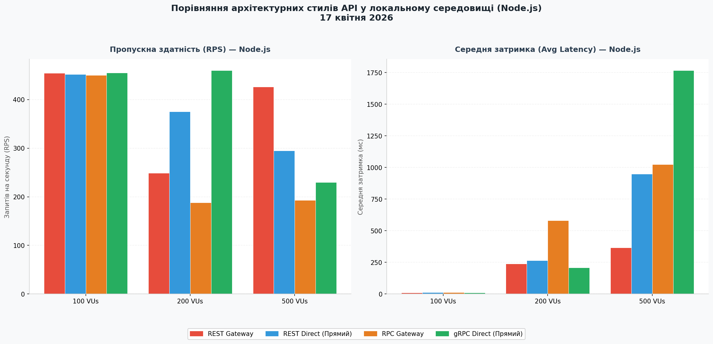
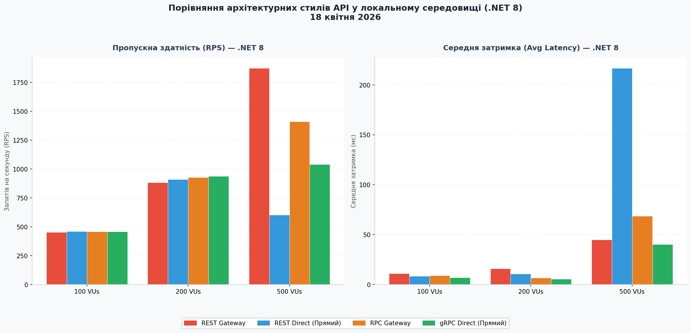
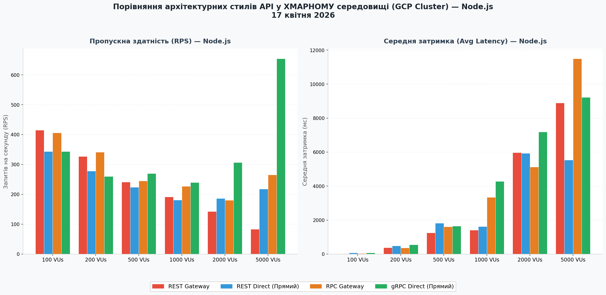
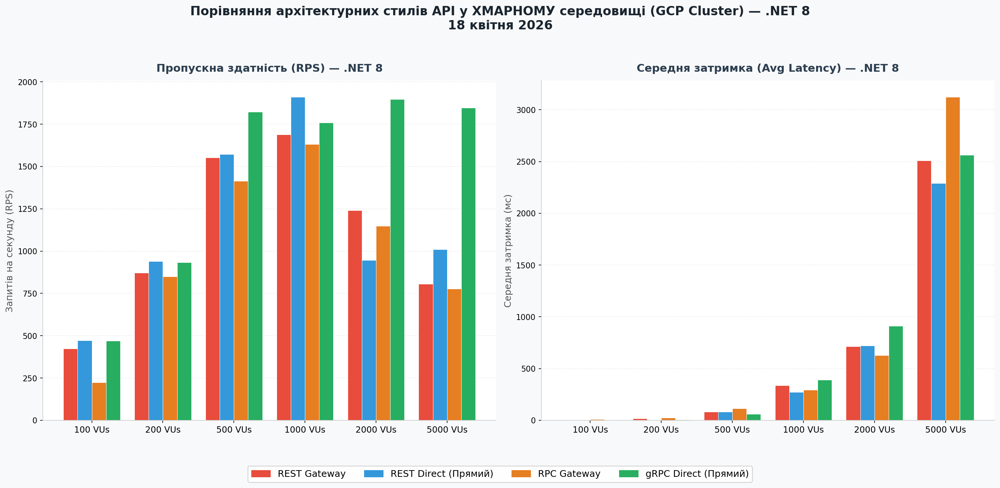

# Порівняльний аналіз архітектурних стилів API — REST проти RPC у розподілених мікросервісних системах

> Програмно-інфраструктурний комплекс для експериментального порівняння пропускної здатності, затримок та ефективності використання ресурсів REST (HTTP/1.1) та gRPC (HTTP/2) API на платформах .NET 8 та Node.js.

---

## Автор

* **ПІБ**: Сорока Юрій Владиславович
* **Група**: ФЕІ-42
* **Керівник**: Гусак Олег Васильович
* **Дата виконання**: 18.05.2026

---

## Загальна інформація

* **Тип проєкту**: Розподілена мікросервісна архітектура з системою навантажувального тестування та моніторингу
* **Мова програмування**: C# (.NET 8), TypeScript (Node.js/NestJS), JavaScript (k6)
* **Фреймворки / Бібліотеки**: ASP.NET Core, NestJS, Prisma ORM, Entity Framework Core, PostgreSQL, InfluxDB, Grafana, k6

---

## Опис функціоналу

* Розподілена мікросервісна структура, розділена на ізольовані домени Користувачів (Users) та Замовлень (Orders).
* Підтримка двох режимів доступу: через шлюз API Gateway (із трансляцією протоколів REST у gRPC) та на пряму до мікросервісів (Direct Mode).
* Автоматизована генерація навантаження за допомогою інструменту k6 у діапазоні від 100 до 10 000 одночасних віртуальних користувачів (VUs).
* Повна ізоляція даних телеметрії завдяки розділенню метрик на рівні окремих схем (баз даних) в InfluxDB для кожного сценарію тестування.
* Візуалізація метрик продуктивності (RPS, процентилі затримок p95/p99, рівень помилок, споживання CPU та RAM) в режимі реального часу через Grafana.

---

## Опис основних класів / файлів

| Клас / Файл | Призначення |
|-------------|-------------|
| `run-tests.sh` | Командний скрипт автоматизації навантажувальних тестів з підтримкою параметризації VUs |
| `deploy-db/docker-compose.yml` | Опис інфраструктури бази даних PostgreSQL, InfluxDB та Grafana |
| `rest-api-gateway` | Шлюз проксіювання REST-трафіку для Node.js та .NET архітектур |
| `rpc-api-gateway` | Шлюз трансляції зовнішніх REST-запитів у внутрішні gRPC-виклики |
| `users-service-rpc` / `users-service-rest` | Реалізація мікросервісу користувачів з підтримкою відповідних протоколів взаємодії |
| `orders-service-rpc` / `orders-service-rest` | Реалізація сервісу замовлень з логікою міжсервісних перевірок |
| `test-rest-vus.js` / `test-rpc-vus.js` | Скрипти k6 для генерації навантаження та збору KPI |
| `influxdb/init/create-databases.sh` | Скрипт початкового створення баз даних в InfluxDB |

---

## Як запустити проєкт "з нуля"

### 1. Встановлення інструментів

* Docker Desktop / Docker Compose
* Git (Git Bash для Windows)
* Утиліта curl (для ручного керування InfluxDB)

### 2. Клонування репозиторію

```bash
git clone https://github.com/Yur1kk/dotnet-nodejs-grpc-rest-benchmark.git
cd dotnet-nodejs-grpc-rest-benchmark
```

### 3. Запуск інфраструктури бази даних та телеметрії

```bash
cd Cloud-Distributed/deploy-db
docker-compose up -d
```

### 4. Ініціалізація баз даних

#### Для InfluxDB (створення ізольованих схем):
```bash
curl -XPOST "http://localhost:8086/query" --data-urlencode "q=CREATE DATABASE k6_rest"
curl -XPOST "http://localhost:8086/query" --data-urlencode "q=CREATE DATABASE k6_rpc"
```

#### Для мікросервісів Node.js (генерація тестових даних/seeding):
```bash
docker exec -it diploma_users_rest npm run seed
docker exec -it diploma_users_rpc npm run seed
docker exec -it diploma_orders_rest npm run seed
docker exec -it diploma_orders_rpc npm run seed
```
*(Для .NET мікросервісів створення схем PostgreSQL та наповнення даними відбуваються повністю автоматично під час першого запуску).*

### 5. Запуск додатків та шлюзів

#### Для екосистеми Node.js:
```bash
cd ../deploy-users && docker-compose up -d --build
cd ../deploy-orders && docker-compose up -d --build
cd ../deploy-gateway && docker-compose up -d --build
```

### 6. Запуск автоматичних тестів

```bash
cd ../deploy-gateway
VUS=500 ./run-tests.sh gateway
```

---

## API приклади

### Створення користувача через REST API Gateway

**POST /api/users**

```json
{
  "name": "Ivan Franko",
  "email": "ivan@test.com",
  "age": 30,
  "role": "user"
}
```

**Response:**

```json
{
  "id": "generated-uuid",
  "name": "Ivan Franko",
  "email": "ivan@test.com",
  "age": 30,
  "role": "user",
  "createdAt": "2026-05-18T12:00:00.000Z"
}
```

---

### Прямий JSON-RPC виклик до мікросервісу користувачів (Порт 3003)

**POST /rpc**

```json
{
  "jsonrpc": "2.0",
  "method": "getUsers",
  "params": {
    "page": 1,
    "limit": 5
  },
  "id": 1
}
```

**Response:**

```json
{
  "jsonrpc": "2.0",
  "result": {
    "data": [
      {
        "id": "uuid-1",
        "name": "Ivan Franko",
        "email": "ivan@test.com"
      }
    ],
    "total": 1
  },
  "id": 1
}
```

---

## Інструкція для користувача

1. **Запуск оточення** — Розгорніть базу даних та інструменти моніторингу за допомогою Docker Compose.
2. **Активація додатків** — Запустіть контейнери обраної технологічної платформи (.NET або Node.js).
3. **Виконання тестів** — Скористайтеся скриптом `run-tests.sh`, вказавши необхідну кількість VUs та цільовий режим (gateway або direct).
4. **Контроль метрик** — Відкрийте браузер за адресою `http://localhost:3006` та оберіть потрібний аналітичний дашборд у Grafana для відстеження RPS, затримок та помилок у реальному часі.

---

## Приклади / скриншоти

Нижче наведено зведені графіки продуктивності (RPS та затримка), згенеровані на основі сирих даних моніторингу з InfluxDB, які порівнюють різні архітектурні підходи в локальному та хмарному (GCP) середовищах.

### Локальне середовище



### Хмарне середовище (GCP Cluster)



---

## Проблеми і рішення

| Проблема | Рішення |
|----------|---------|
| Змішування результатів різних тестів в InfluxDB | Реалізовано ізоляцію даних шляхом створення окремих схем k6_rest та k6_rpc |
| Високі затримки на шлюзі при gRPC трансляції в Node.js | Виявлено обмеження однопотокової моделі NestJS. Запропоновано перехід на багатопотокову платформу .NET 8 |
| Мережеві блокування портів у хмарі GCP | Налаштовано правила брандмауера (VPC Firewall) консолі управління для відкриття TCP-портів 3000-3006 |

---

## Використані джерела / література

1. Fernando R. Evaluating Performance of REST vs. gRPC. Medium. [Режим доступу: https://medium.com/make-it-working/evaluating-performance-of-rest-vs-grpc-1b8bdf0b22da]
2. Newman S. Building Microservices (2nd Edition). O'Reilly Media, 2021. С. 3. [Режим доступу: https://books.google.com.ua/books?id=aPM5EAAAQBAJ]
3. Richardson C. Pattern: API Gateway. Microservices.io. [Режим доступу: https://microservices.io/patterns/apigateway.html]
4. Fielding R. T. Architectural Styles and the Design of Network-based Software Architectures. Doctoral dissertation. University of California, Irvine, 2000. [Режим доступу: https://roy.gbiv.com/pubs/dissertation/fielding_dissertation.pdf]
5. gRPC Core Concepts. Official gRPC Documentation. [Режим доступу: https://grpc.io/docs/what-is-grpc/core-concepts/]
6. Документація платформи .NET 8. Документація Microsoft Learn. [Режим доступу: https://learn.microsoft.com/uk-ua/dotnet/]
7. Огляд архітектури Node.js та циклу подій. Офіційна документація Node.js. [Режим доступу: https://nodejs.org/uk/docs/guides/event-loop-timers-and-nexttick/]
8. Вступ до навантажувального тестування за допомогою k6. Офіційна документація Grafana Labs. [Режим доступу: https://k6.io/docs/]
9. ASP.NET Core documentation. Microsoft Learn. [Режим доступу: https://learn.microsoft.com/en-us/aspnet/core/]
10. NestJS Documentation: A progressive Node.js framework. Official NestJS Documentation. [Режим доступу: https://docs.nestjs.com/]

---

## Screenshots

